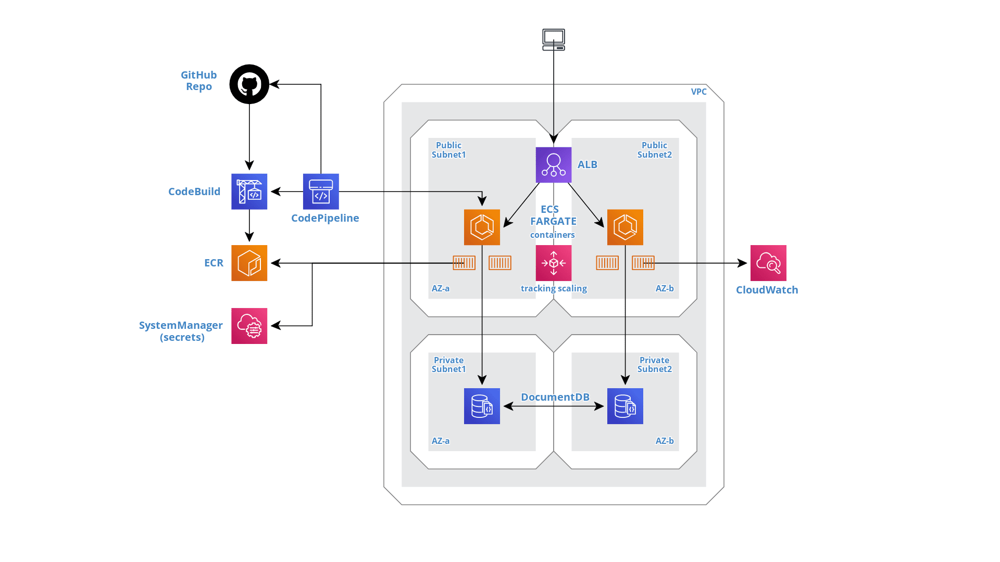

# Phoenix Application Problem - Solution 

This is my AWS implementation of required infrastructure to solve Phoenix Application Problem.
Original GitHub repo is [here](https://github.com/claranet-coast/cloud-phoenix-kata)

## Problem Summary

The development team has released the phoenix application code.
Your task is to create the production infrastructure
for the Phoenix application.

1. Automate the creation of the infrastructure and the setup of the application.
2. Recover from crashes. Implement an autorestart mechanism.
3. Backup the logs and database with a rotation of 7 days
4. Notify any CPU peak
5. Implements a CI/CD pipeline for the code
6. Scale when the number of requests is greater than 10 req /sec

# Infrastructure Overview

Infrastructure is hosted by AWS. CloudFormation templates are provided in order to build infrastructure and automatic CI/CD pipeline. 

## Application -> Dockerize it!

Phoneix application runs in docker containers hosted by AWS ECS (Fargate) service.  
ECS Service provides recovery/autorestart mechanism.

1. `Dockerfile` is used to specify docker image contents (and correct Node source image).
2. `buildspec.ylm` is used by CodeBuild to build docker image and store it in a private ECR repository.

## Application Requirements

Phoenix application needs a MongoDB as database. AWS DocumentDB is used to provide a managed and  high-available database. Backup is performed automatically and retention period is 7 days.
DB_CONNECTION_STRING env variable is provided to application using a `secret` System Manager Parameter in order to hide username/password.

## Load balancing and scaling

Application Load Balancer is used in front of ECS Cluster. A Listener and a Target Group is defined in order to forward HTTP request to Phoenix application ECS Service.  
Scaling is performed by defining an Application Autoscaling Policy attached to ECS Service: original requirement is to "scale if >10 req/sec". Metric `ALBRequestCountPerTarget` is used in the Tracking Scaling policy with a default threshold of `10/sec * 60 sec = 600` (metric granularity is 1 minute).

## Network, Network Security and HA

A new VPC is created to host application infrastructure. 
VPC is splitted in:
- 2 public subnets (2 different AZs), hosting ALB e ECS Cluster.
- 2 private subnets (2 different AZs), hosting DocumentDB.

Security Groups are configured to limit ingress traffic according to this chain: `(public_internet) -> ALB -> ECS -> DocumentDB`

## Logs and Alerts

CloudWatch is used to store logs from ECS tasks, with a retention period of 7 days.
A CloudWatch Alarm is configured to monitor `CPUUtilization` of ECS Service for a threshold of 90%. No Alarm action is configured (add an email notification?) 

## CI/CD Pipeline.. let's rock

The CI/CD pipeline is implemented by:
- a CodeBuild project to build application docker image and to store it in application ECR repository
- a CodePipeline pipeline to monitor GitHub repo for changes, run CodeBuild to update docker image and deploy new image on ECS Service.
S3 bucket is used to store CodePipeline artifacts.

Note: FIRST run of CI/CD pipeline deploy stage fails because pipeline is created before ECS Cluster deployment. This is normal and required to build first docker image of our application. Next run (source code changed) will perform all stages successfully.

## Critical endpoints blocking

Optionally, it's possible to block `/crash` and `/generatecert` endpoints: please uncomment `UnwantedRule` in CloudFormation template to redirect (301) requests to these endpoints.

# CloudFormation Templates

CloudFormation templates are stored in `aws` folder of this repository. 
- `phoenix.yaml` is the main templates. It's specific for this appication. Use it to build application stack and all nested stacks. 
- `cdci.yaml` is the CI/CD pipeline stack.
- `vpc.yaml` is the network resources stack.
- `ald.yaml` is the Application Load Balancer stack.
- `documentdb.yaml` is the DocumentDB (MongoDB) stack.
- `ecsapp.yaml` is the ECS Cluster stack.

Nested stack templates are generic and reusable to deploy different applications.

# Finally.. How to run it!

## Requirements

You need to specify a valid GitHub OAuth token in `GitHubOAuthToken` parameter of main `phoenix.yaml` CloudFormation template. Please visit [GitHub](https://github.com/settings/tokens) to generate a new one.

## AWS CLI

AWS CLI command to create the Phoenix Application Stack is:

    aws cloudformation create-stack --stack-name Phoenix --template-url https://cfvn.s3-eu-west-1.amazonaws.com/phoenix/phoenix.yaml --capabilities CAPABILITY_IAM --parameters ParameterKey=GitHubOAuthToken,ParameterValue=<yourOAuthToken>

Please replace `<yourOAuthToken>` with your token.

At the end of application stack deployment, the output parameter `PhoenixUrl` reports the public application URL.

Templates are hosted in a public access S3 bucket to simplify deployment. 
Feel free to clone this repository and use your own. 
In main CloudFormation template `phoenix.yaml` the parameter `ChildTemplatesLocation` could be changed to a different location. 

# Notes

- Please check CloudFormation templates for more implementation details.
- Only one instance is created during DocumentDB deployment (costs).
- CI/CD pipeline roles need to be properly changed to include required rights only.
- No application source code changes are required.

 

